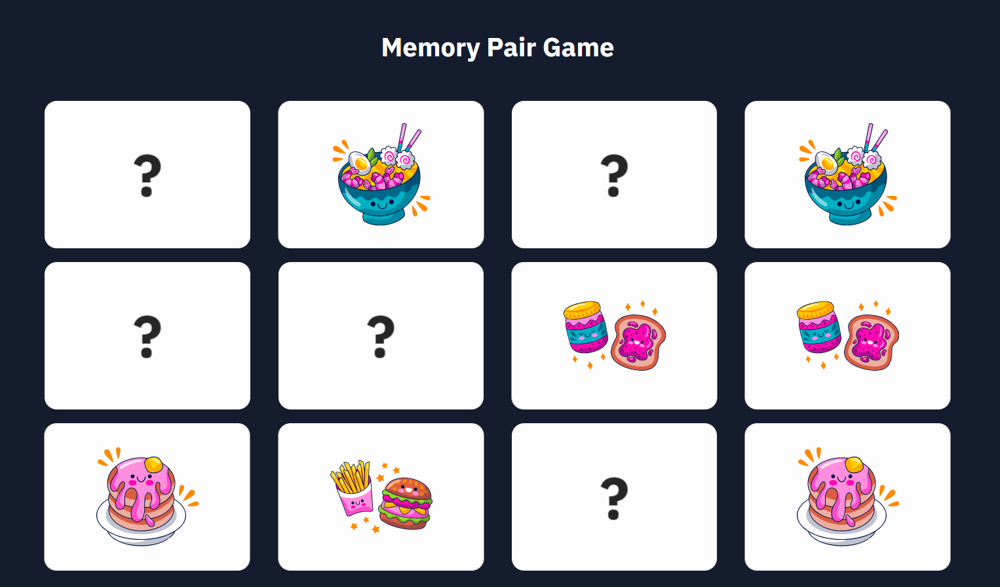

# Memory game " Find a couple"

> Link to the game: https://samoylovxo.github.io/memory-game_find-a-couple/dist/index.html

**_EN:_**

## Hello everyone!

- I think that you have definitely played a similar game and it will not surprise you, but this project was made for my portfolio.

- This is an easy game in which you will have 10 cards in front of you, turning them over, you will have to collect 5 pairs with the same pictures of food.

#### **Enjoy the game!**

 

**_RU:_**

## Всем привет!

- Я думаю, что вы точно играли в подобную игру и она вас не удивит, но данный проект сделан для моего портфолио.

- Это легкая игра, в который перед вами будет 10 карточек, переворачивая которые вы должны будете собрать 5 пар с одинаковыми картинками еды.

#### **Приятной игры!**

 

> Thank you, the portfolio will be replenished.
